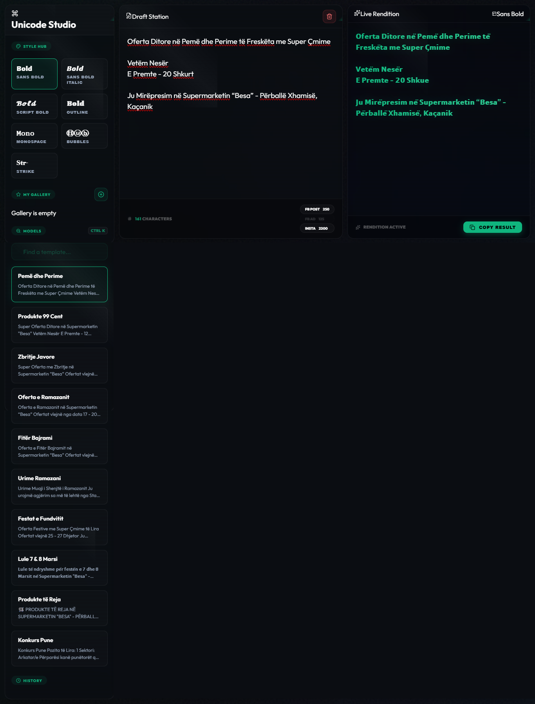

# Unicode Studio - Platinum Edition by Rilind Kyçyku

Projekti është i tipit **Text Styling** dhe **Unicode Transformation Engine**.

Ky projekt është i punuar në:

- **React JS** - Frontend
- **Framer Motion** - Animacionet
- **Lucide React** - Ikonat
- **Vanilla CSS** – Stilimi (Custom Platinum Design)

# Informata rreth Funksioneve, Konfigurimit dhe Pamjes

## Funksionet

- **Real-Time Rendition** - Konvertimi i tekstit bëhet në kohë reale ndërsa përdoruesi shkruan, pa pasur nevojë për rifreskim të faqes.
- **Breathing Ambient UI** - Një sistem vizual dinamik me gradientë që lëvizin dhe efekte "light sweep" që i japin aplikacionit një ndjesi premium.
- **Draft Station** - Një hapësirë pune e dedikuar me numërues të saktë të shkronjave dhe limite të paracaktuara për rrjetet sociale (Facebook, Instagram, etj.).
- **Platinum Copy System** - Sistem i avancuar i kopjimit me indikatorë "Pill-status" dhe konfirmim vizual për çdo aksion.
- **Sistemi i Filtrave/Modeleve** - Mundëson kërkimin dhe zgjedhjen e stilit Unicode përmes shkurtores **CTRL + K**.
- **Mobile Optimized** - Ndërfaqe plotësisht e optimizuar për përdorim në pajisje mobile, duke ruajtur kompaktësinë dhe estetitkën "Platinum".
- **Holographic Scanlines** - Efekt vizual retro-tech mbi të gjithë ekranin që përforcon stilin e terminalit të sofistikuar.

## Konfigurimi

Së pari duhet të bëni **clone** repozitorin dhe pastaj të hapni projektin në Visual Studio Code. Hapni terminalin dhe ekzekutoni këto komanda:

- **npm install** - Bën instalimin automatik të paketave të nevojshme (React, Framer Motion, Lucide).
- **npm run dev** - Bën startimin e projektit në ambientin e zhvillimit.
- **npm run build** - Bën Build projektin për versionin e publikimit (production).

_Shënim: Sigurohuni që keni Node.js të instaluar në sistemin tuaj përpara se të filloni._

## Pamja e Unicode Studio

